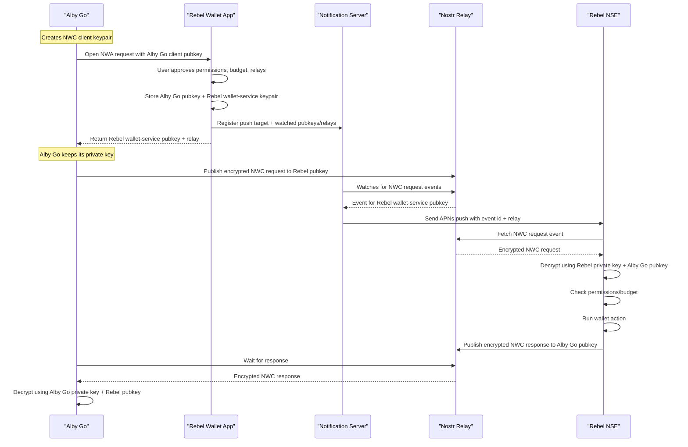
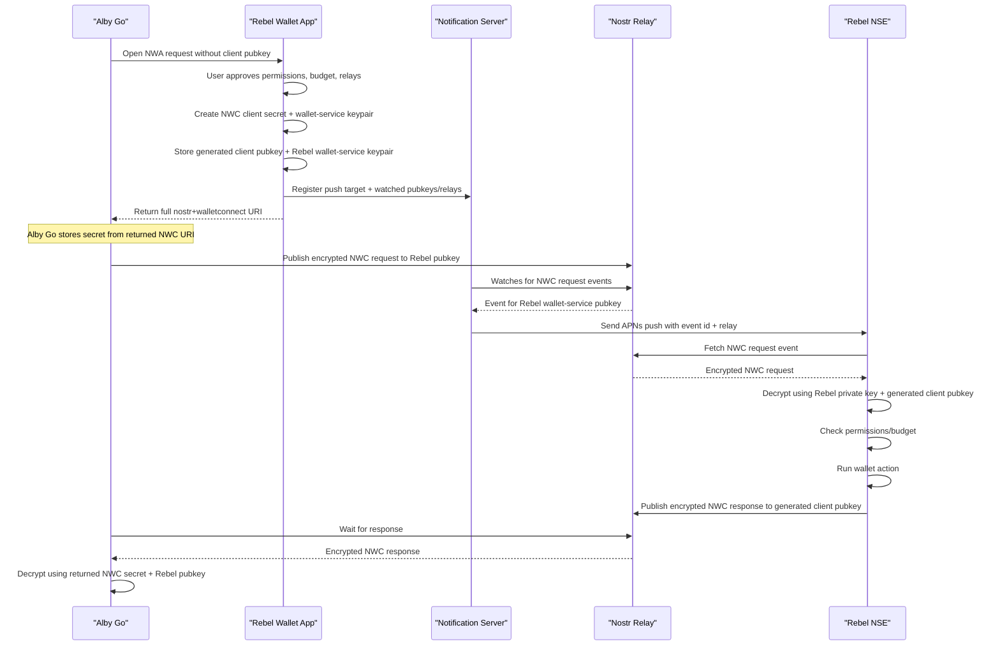

# Nostr Wallet Auth (NWA)

**Status:** draft optional

## Abstract

Nostr Wallet Auth (NWA) defines an app-initiated authorization flow for creating a NIP-47 / Nostr Wallet Connect (NWC) connection without manually copying an NWC URI between apps.

NWA supports two setup modes:

- **Client-created secret mode:** the requesting app generates the NWC client secret locally before opening the wallet. The app shares only the corresponding client public key, requested capabilities, relays, and callback information with the wallet. The wallet records the approved policy for that client public key and returns the wallet service public key and selected relay information. The requesting app then assembles the final `nostr+walletconnect://` URI locally using its own secret.
- **Wallet-created secret mode:** the wallet creates the NWC client secret after user approval and returns a complete `nostr+walletconnect://` URI to the requesting app. This is less ideal for secret handling, but it matches existing NWC pairing-code behavior and is useful for compatibility.

This specification does not change NIP-47 request or response events. It standardizes the setup handoff between an app and a wallet.

This flow is inspired by OAuth redirect UX, but it is not OAuth. It does not define OAuth clients, access tokens, refresh tokens, authorization codes, token endpoints, or OpenID Connect behavior.

### Client-Created Secret Flow



### Wallet-Created Secret Flow



## Motivation

Today, mobile NWC setup often requires:

1. Open wallet app.
2. Create an NWC string.
3. Copy it.
4. Switch apps.
5. Paste it into the requesting app.

That works, but it is clunky on mobile and pushes secret material through the clipboard. It also gives the wallet little structured context about the requesting app, requested methods, suggested budget, and preferred relays.

NWA improves this flow:

1. Requesting app opens a wallet auth URI.
2. Wallet app opens directly to an NWC approval screen.
3. User reviews and approves wallet-side policy.
4. Wallet returns either connection metadata or a complete NWC URI.
5. Requesting app stores the normal NWC connection.

## Prior Art And Traction

NWA is not a brand-new idea. It appeared in earlier Mutiny Wallet and ZapplePay work and is still present in Alby's current SDK documentation as "Nostr Wallet Auth" for mobile-first or self-custodial wallets.

NIP-47 also includes a simpler deep-link appendix using `nostrnwc://connect`, where the wallet returns a complete NWC pairing code. That flow improves mobile handoff but can still return a URI containing client secret material.

Newer NWC "1-click connection" work converges on the stronger client-created-secret model: the requesting app generates the client secret, shares only the client public key with the wallet, and constructs the final NWC URI locally after authorization. This draft follows that foundation and keeps the NWA name for continuity, while still documenting wallet-created secret returns for compatibility.

## Design Summary

Client-created secret mode:

```text
Requesting app
-> generates NWC client secret and client public key
-> opens NWA URI with client public key and requested policy
-> wallet app displays connection approval screen
-> user chooses permissions, budget, interval, and relays
-> wallet authorizes the client public key
-> wallet publishes normal NIP-47 info metadata
-> wallet redirects to return URI with wallet public key and relay metadata
-> requesting app constructs normal nostr+walletconnect URI locally
```

Wallet-created secret mode:

```text
Requesting app
-> opens NWA URI without a client public key
-> wallet app displays connection approval screen
-> user chooses permissions, budget, interval, and relays
-> wallet creates NWC client secret and authorizes generated client public key
-> wallet publishes normal NIP-47 info metadata
-> wallet redirects to return URI with complete nostr+walletconnect URI
-> requesting app stores returned nostr+walletconnect URI
```

The resulting connection is still a normal NWC connection:

```text
nostr+walletconnect://<wallet_service_pubkey>?relay=<relay>&secret=<client_secret>
```

The wallet auth request is only a setup handoff.

## Goals

This specification aims to:

- Avoid manual copy/paste for NWC setup.
- Prefer avoiding NWC client secret handoff through the clipboard or callback URI.
- Permit complete NWC URI returns when needed for compatibility.
- Let requesting apps open a wallet-specific or generic wallet auth flow.
- Let wallets show a native approval screen before authorizing NWC access.
- Let wallets keep permission, budget, and policy decisions wallet-side.
- Work on iOS, Android, and web.
- Preserve standard NIP-47 connection URI semantics.
- Stay compatible with existing NWA and NIP-47 one-click connection ideas where practical.

## Non-goals

This specification does not define:

- A replacement for NIP-47.
- OAuth or OpenID Connect compatibility.
- Server-side token exchange.
- A wallet discovery registry.
- A mandatory permission model for all wallets.
- A required UI.
- A guarantee that every platform can show a generic wallet chooser.

## Terms

### Requesting app

The app that wants wallet access. Examples include a point-of-sale app, bill-pay app, subscription app, web app, or another wallet-adjacent app.

### Wallet app

The app that authorizes the NWC connection for the user.

### Wallet service public key

The NIP-47 wallet service public key that receives encrypted NWC requests.

### Client secret

The NWC client secret key generated and retained by the requesting app. It is used to sign NWC request events and derive the client public key.

### Client public key

The public key corresponding to the client secret. This is shared with the wallet during NWA setup and authorized by the wallet.

### Wallet auth request

The URI opened by the requesting app to start NWC authorization in a wallet app.

### Return URI

The callback URI supplied by the requesting app. The wallet app opens this URI after approval, cancellation, or error.

### NWC URI

The normal NIP-47 connection URI constructed by the requesting app after approval.

## URI Forms

Implementations SHOULD support at least one of these forms.

### Generic NWA Scheme

The generic scheme is intended for platforms that can route a URI to one of several capable wallets.

```text
nostr+walletauth://connect
```

Example:

```text
nostr+walletauth://connect?version=1&name=Alby%20Go&app_id=com.alby.go&pubkey=687dd8ece211539364549b1f32c63eceec1e0661009ba65cf8ff2e73ba000746&return_to=com.alby.go%3A%2F%2Fnwa%2Fcallback&state=4f7c8b...&relay=wss%3A%2F%2Frelay.getalby.com&relay=wss%3A%2F%2Frelay2.getalby.com&request_methods=pay_invoice%20get_balance%20make_invoice&max_amount=500000&budget_renewal=monthly
```

### Wallet-Specific NWA Scheme

A wallet-specific scheme is recommended when the requesting app wants to open a specific installed wallet.

```text
nostr+walletauth+rebelwallet://connect
```

Example:

```text
nostr+walletauth+rebelwallet://connect?version=1&name=Alby%20Go&app_id=com.alby.go&pubkey=687dd8ece211539364549b1f32c63eceec1e0661009ba65cf8ff2e73ba000746&return_to=com.alby.go%3A%2F%2Fnwa%2Fcallback&state=4f7c8b...&relay=wss%3A%2F%2Frelay.getalby.com&request_methods=pay_invoice%20get_balance
```

Wallets MAY also support private app schemes, such as:

```text
rebelwallet://nwa/connect
```

This document standardizes the query parameters and response behavior, not every wallet's private scheme name.

### HTTPS / Universal Link

Wallets MAY expose an HTTPS entry point for web, iOS Universal Links, Android App Links, and install fallback pages.

```text
https://wallet.example/nwa/connect
```

Example:

```text
https://wallet.example/nwa/connect?version=1&name=Alby%20Go&app_id=https%3A%2F%2Falby-go.example&pubkey=687dd8ece211539364549b1f32c63eceec1e0661009ba65cf8ff2e73ba000746&return_to=https%3A%2F%2Falby-go.example%2Fnwa%2Fcallback&state=4f7c8b...&relay=wss%3A%2F%2Frelay.getalby.com&request_methods=pay_invoice%20get_balance
```

When returning connection metadata or a complete NWC URI to an HTTPS callback, wallets SHOULD place result parameters in the URI fragment, not the query string.

## Request Parameters

The wallet auth request uses query parameters.

Parameter names and values MUST be UTF-8 percent-encoded. Repeated parameters are allowed where explicitly defined, such as `relay`.

| Parameter | Requirement | Description |
| --- | --- | --- |
| `version` | REQUIRED | Protocol version. MUST be `1`. |
| `secret_mode` | OPTIONAL | `client` or `wallet`. Defaults to `client` when `pubkey` is present, otherwise `wallet`. |
| `pubkey` | CONDITIONALLY REQUIRED | Client public key generated by the requesting app. Required for client-created secret mode. Omitted for wallet-created secret mode. |
| `return_to` | REQUIRED | Callback URI opened after approval, cancellation, or error. |
| `state` | REQUIRED | Opaque nonce generated by the requesting app. Returned unchanged. |
| `name` | RECOMMENDED | Human-readable requesting app name. |
| `app_id` | RECOMMENDED | Platform app id, bundle id, package name, or web origin. |
| `icon` | OPTIONAL | HTTPS URL for the requesting app icon. |
| `relay` | RECOMMENDED | Preferred relay URL. MAY appear more than once. |
| `request_methods` | OPTIONAL | Space-separated requested NWC methods. |
| `notification_types` | OPTIONAL | Space-separated requested NIP-47 notification types. |
| `max_amount` | OPTIONAL | Suggested maximum spend amount in sats per budget period. |
| `budget_renewal` | OPTIONAL | Suggested budget renewal period. |
| `expires_at` | OPTIONAL | Unix timestamp after which the connection should be rejected or expire. |
| `isolated` | OPTIONAL | Boolean hint requesting an isolated wallet service key for this connection. |
| `metadata` | OPTIONAL | URL-encoded JSON object for display-only metadata. |

Wallets MAY ignore optional parameters.

Wallets MUST NOT treat requested methods, budgets, notification types, or metadata as user consent. The user must approve the final wallet-side policy in the wallet app.

### `version`

```text
version=1
```

Wallets MUST reject unsupported versions.

### `secret_mode`

The `secret_mode` parameter declares which side creates the NWC client secret.

Allowed values:

- `client`: the requesting app creates the NWC client secret and includes `pubkey`.
- `wallet`: the wallet creates the NWC client secret after user approval and returns a complete NWC URI.

If `secret_mode` is omitted and `pubkey` is present, wallets SHOULD treat the request as `secret_mode=client`.

If `secret_mode` is omitted and `pubkey` is absent, wallets MAY treat the request as `secret_mode=wallet`.

Requesting apps SHOULD use `secret_mode=client` when possible.

### `pubkey`

The `pubkey` value is the NWC client public key controlled by the requesting app.

```text
pubkey=687dd8ece211539364549b1f32c63eceec1e0661009ba65cf8ff2e73ba000746
```

In client-created secret mode, the requesting app MUST retain the corresponding client secret locally and MUST NOT include it in the NWA request URI.

Wallets SHOULD authorize exactly this client public key for the approved policy.

In wallet-created secret mode, `pubkey` is omitted. The wallet creates a client secret after approval, derives the generated client public key, stores that generated client public key in the approved policy, and returns a complete NWC URI containing the generated client secret.

### `return_to`

The `return_to` value is the callback URI that the wallet opens after the user approves, cancels, or an error occurs.

Examples:

```text
com.alby.go://nwa/callback
https://alby-go.example/nwa/callback
```

The requesting app SHOULD use a return URI that it controls.

The `return_to` URI SHOULD NOT include a fragment. Wallets use the fragment to return result parameters. If `return_to` already contains a fragment, wallets SHOULD reject the request with `invalid_request`.

### `state`

The requesting app MUST generate a fresh, unpredictable `state` value for each wallet auth request.

Wallets MUST return the exact `state` value in the callback.

Requesting apps MUST verify that the returned `state` matches an outstanding wallet auth request before accepting the returned connection metadata.

### `name`

The wallet SHOULD display `name` to the user.

Example:

```text
name=Alby%20Go
```

### `app_id`

The wallet MAY display or log `app_id`. On native platforms this is commonly a bundle id or package name. On web it SHOULD be the web origin.

Examples:

```text
app_id=com.alby.go
app_id=https%3A%2F%2Falby-go.example
```

The wallet SHOULD NOT trust `app_id` as proof of identity unless it is verified by the platform or by an HTTPS origin relationship.

### `icon`

The wallet MAY display an icon from an HTTPS URL.

Wallets MUST treat the icon URL as untrusted display data. Wallets SHOULD avoid fetching arbitrary non-HTTPS icon URLs.

### `relay`

The request MAY contain one or more relay parameters.

```text
relay=wss%3A%2F%2Frelay.getalby.com
relay=wss%3A%2F%2Frelay2.getalby.com
```

Wallets MAY:

- accept all requested relays
- choose one requested relay
- add their own default relays
- return wallet-selected relays in the callback
- let the user edit relays
- reject unsupported relays

The requesting app MUST use the relay or relays returned by the wallet when constructing the final NWC URI. If the wallet returns no relay, the requesting app MAY use the requested relay set.

### `request_methods`

The `request_methods` parameter is a space-separated list of requested NWC methods.

Example:

```text
request_methods=pay_invoice%20get_balance%20make_invoice%20list_transactions
```

Wallets SHOULD map requested methods to wallet-side permission controls when possible.

Wallets MAY add mandatory safe methods such as `get_info`.

Wallets MAY show presets such as:

- Full Access
- Read Only
- Custom

### `notification_types`

The `notification_types` parameter is a space-separated list of requested NIP-47 notification types.

Example:

```text
notification_types=payment_received%20payment_sent
```

Wallets MAY ignore unsupported notification types.

### `max_amount`

The requesting app MAY suggest a maximum spend amount in sats.

```text
max_amount=500000
```

The wallet SHOULD display the budget to the user and MAY let the user edit it.

### `budget_renewal`

The requesting app MAY suggest a budget renewal interval.

Recommended values:

- `never`
- `hourly`
- `daily`
- `weekly`
- `monthly`
- `yearly`

Example:

```text
budget_renewal=monthly
```

Wallets MAY support additional intervals, but SHOULD ignore unknown values from the request.

### `expires_at`

The requesting app MAY include an expiration timestamp.

```text
expires_at=1783555200
```

Wallets SHOULD reject expired requests before showing approval UI.

If the wallet stores an expiration policy for the connection, it SHOULD enforce that policy against future NWC requests.

### `isolated`

The requesting app MAY set `isolated=true` to ask the wallet to use a unique wallet service public key for this connection.

Wallets MAY ignore this hint. Unique wallet service public keys can reduce metadata linkage across connections, but they may increase wallet implementation complexity.

### `metadata`

The `metadata` parameter MAY contain URL-encoded JSON for display-only context.

Example decoded value:

```json
{
  "purpose": "Monthly rent autopay",
  "account_name": "Apartment 4B"
}
```

Wallets MUST treat metadata as untrusted display data. It MUST NOT grant permissions or override wallet policy.

## Wallet Behavior

After receiving a wallet auth request, the wallet SHOULD:

1. Parse the URI.
2. Verify `version`.
3. Determine `secret_mode`.
4. For client-created secret mode, verify `pubkey` is present and well formed.
5. For wallet-created secret mode, verify `pubkey` is absent or ignore it.
6. Verify `return_to` is present.
7. Verify `state` is present.
8. Reject the request if `expires_at` is expired.
9. Show a wallet-native approval screen.
10. Display the requesting app name and requested capabilities.
11. Let the user choose wallet-side permissions, budget, interval, and relays.
12. In client-created secret mode, authorize the requested client public key only after explicit user approval.
13. In wallet-created secret mode, create the NWC client secret and authorize the generated client public key only after explicit user approval.
14. Publish or update the normal NIP-47 info event for the selected wallet service public key.
15. Open the return URI with the result.

Wallets SHOULD NOT authorize a requested or generated client public key before the user approves.

Wallets SHOULD let the user cancel.

Wallets MAY remember trusted requesting apps, but SHOULD still show the final connection policy before creating a spend-capable NWC authorization.

## Return URI

The wallet returns to the requesting app by opening the `return_to` URI with result parameters.

For custom-scheme callbacks, wallets MAY use query parameters or fragments. For HTTPS callbacks, wallets SHOULD use fragments so callback data is not sent to web servers in request paths or query strings.

Return parameter names and values MUST use the same encoding rules as request parameters.

### Approved: Client-Created Secret

```text
com.alby.go://nwa/callback#state=4f7c8b...&status=approved&wallet_pubkey=abcdef...&relay=wss%3A%2F%2Frelay.getalby.com&relay=wss%3A%2F%2Frelay2.getalby.com&lud16=user%40wallet.example
```

HTTPS example:

```text
https://alby-go.example/nwa/callback#state=4f7c8b...&status=approved&wallet_pubkey=abcdef...&relay=wss%3A%2F%2Frelay.getalby.com
```

The requesting app verifies `state`, reads the returned wallet service public key and relays, and constructs the final NWC URI locally:

```text
nostr+walletconnect://<wallet_pubkey>?relay=wss%3A%2F%2Frelay.getalby.com&secret=<local_client_secret>&lud16=user%40wallet.example
```

### Approved: Wallet-Created Secret

```text
com.alby.go://nwa/callback#state=4f7c8b...&status=approved&nwc_uri=<url-encoded-nwc-uri>
```

For compatibility with existing NIP-47 deep-link behavior, wallets MAY return the same value as `value` instead of, or in addition to, `nwc_uri`.

If both `nwc_uri` and `value` are present, they MUST contain the same decoded NWC URI.

```text
com.alby.go://nwa/callback#state=4f7c8b...&status=approved&value=<url-encoded-nwc-uri>
```

The decoded NWC URI is a normal NIP-47 connection URI:

```text
nostr+walletconnect://<wallet_pubkey>?relay=wss%3A%2F%2Frelay.getalby.com&secret=<wallet_generated_client_secret>&lud16=user%40wallet.example
```

The requesting app verifies `state`, decodes the returned NWC URI, stores it securely, and uses normal NIP-47.

### Cancelled

```text
com.alby.go://nwa/callback#state=4f7c8b...&status=cancelled
```

### Error

```text
com.alby.go://nwa/callback#state=4f7c8b...&status=error&error=unsupported_methods
```

Suggested error values:

- `invalid_request`
- `unsupported_version`
- `expired_request`
- `unsupported_methods`
- `unsupported_relay`
- `user_cancelled`
- `internal_error`

## Return Parameters

| Parameter | Requirement | Description |
| --- | --- | --- |
| `state` | REQUIRED | The original request `state`. |
| `status` | REQUIRED | `approved`, `cancelled`, or `error`. |
| `wallet_pubkey` | REQUIRED when approved in client-created secret mode | NIP-47 wallet service public key. |
| `relay` | RECOMMENDED when approved in client-created secret mode | Wallet-selected relay URL. MAY appear more than once. |
| `nwc_uri` | REQUIRED when approved in wallet-created secret mode | URL-encoded normal NWC URI containing the wallet-generated client secret. |
| `value` | OPTIONAL | Compatibility alias for `nwc_uri`, matching existing NIP-47 deep-link behavior. |
| `lud16` | OPTIONAL | Lightning address associated with the wallet/user. |
| `error` | RECOMMENDED when error | Machine-readable error code. |
| `error_description` | OPTIONAL | Human-readable error text. |

Requesting apps MUST reject callbacks with missing or mismatched `state`.

In client-created secret mode, requesting apps MUST reject `status=approved` callbacks without `wallet_pubkey`.

In wallet-created secret mode, requesting apps MUST reject `status=approved` callbacks without `nwc_uri` or `value`.

## Wallet-Created Secret Compatibility

Wallet-created secret mode returns a complete `nostr+walletconnect://` URI through a callback parameter such as `nwc_uri` or `value`.

Wallets MAY support this mode for compatibility. However, new NWA implementations SHOULD prefer client-created secret mode so the client secret never leaves the requesting app.

Requesting apps MAY accept `value` or `nwc_uri` from trusted wallets.

## Platform Guidance

### iOS

iOS does not provide a reliable generic chooser for arbitrary custom URI schemes. Requesting apps SHOULD use one of:

- a wallet-specific NWA scheme such as `nostr+walletauth+rebelwallet://connect`
- a wallet private scheme such as `rebelwallet://nwa/connect`
- a wallet Universal Link such as `https://wallet.example/nwa/connect`
- an in-app list of supported wallet apps

Wallet apps SHOULD register their custom scheme and, when possible, a Universal Link for install fallback and web compatibility.

Requesting apps SHOULD use a custom-scheme or Universal Link `return_to` that they control.

### Android

Android can route generic intent filters more naturally than iOS. Wallets MAY register an intent filter for:

```text
nostr+walletauth://connect
```

Requesting apps MAY either:

- open the generic URI and let Android resolve capable wallets
- target a specific wallet package with an explicit intent
- open a wallet-specific URI
- open an HTTPS App Link

Android requesting apps SHOULD still verify `state` on return.

### Web

Web flows SHOULD use HTTPS URLs for both request and return.

Wallets returning connection metadata or a complete NWC URI to a web app SHOULD place result parameters in the fragment.

Web apps SHOULD remove the fragment from browser history after consuming it.

Example:

```text
https://wallet.example/nwa/connect?version=1&pubkey=687dd8ece211539364549b1f32c63eceec1e0661009ba65cf8ff2e73ba000746&return_to=https%3A%2F%2Fapp.example%2Fnwa%2Fcallback&state=4f7c8b...
```

Return:

```text
https://app.example/nwa/callback#state=4f7c8b...&status=approved&wallet_pubkey=abcdef...&relay=wss%3A%2F%2Frelay.getalby.com
```

## Security Considerations

### Client secret handling

In client-created secret mode, the requesting app MUST generate and retain the NWC client secret locally.

In client-created secret mode, the client secret MUST NOT be included in the NWA request URI.

Wallets SHOULD NOT ask the requesting app to send a client-created secret.

In wallet-created secret mode, the wallet creates the client secret and returns it inside a complete NWC URI. Wallets SHOULD return that URI in a fragment rather than a query string and SHOULD avoid logging it.

### Callback data

In client-created secret mode, the approved callback does not need to contain client secret material. It SHOULD contain only the wallet service public key, relay metadata, and optional display metadata.

In wallet-created secret mode, the approved callback contains a complete NWC URI. Requesting apps MUST treat the returned `nwc_uri` or `value` as secret material.

Wallets and requesting apps SHOULD avoid logging full request and return URIs.

### State validation

The `state` parameter protects against confused-deputy and stale callback handling.

Requesting apps MUST:

- generate a fresh unpredictable `state`
- store it with the pending request and any local client secret
- verify it on return
- reject duplicate or unknown states

### User approval

Wallets MUST NOT interpret a wallet auth request as consent.

The user must approve the NWC connection in the wallet app.

Spend-capable methods such as `pay_invoice` SHOULD be clearly shown with budget and interval controls.

### Requesting app identity

`name`, `app_id`, and `icon` are self-asserted unless verified by the platform or by an HTTPS origin relationship.

Wallets SHOULD display these values as helpful context, not as cryptographic proof.

### Callback allowlists

Wallets MAY restrict `return_to` schemes or origins. For example, a wallet MAY require HTTPS Universal Links for web callbacks, or warn when returning to an unknown custom scheme.

Requesting apps SHOULD use stable return URI schemes or origins.

### Metadata

Metadata is untrusted display data. Wallets SHOULD sanitize metadata before display and MUST NOT grant permissions based only on metadata.

## Privacy Considerations

The wallet auth request may reveal the requesting app name, app id, icon URL, requested relays, requested methods, notification types, and suggested budget to the wallet.

The wallet service public key may reveal metadata if reused across many connections. Wallets SHOULD consider unique wallet service keys per connection when privacy matters.

The returned NWC URI gives the requesting app whatever wallet access the user approved. Requesting apps SHOULD store it securely and SHOULD provide users a way to disconnect.

Wallets SHOULD let users review and revoke NWC connections later.

## Compatibility With NWC Wake

NWA only creates or authorizes the NWC connection. If the wallet supports NWC Wake, the wallet can register the approved client public key, wallet service public key, selected relay set, and push token with its notification server after approval.

The requesting app does not need to know whether the wallet uses an always-on service, a foreground websocket, or NWC Wake behind the scenes. It should use the resulting NWC URI normally.

## Example: Client-Created Secret

### Requesting App Setup

The requesting app:

1. Generates a new NWC client secret.
2. Derives the client public key.
3. Stores the pending `state` with the client secret.
4. Opens the wallet auth URI.

### Request

```text
nostr+walletauth+rebelwallet://connect?version=1&name=Alby%20Go&app_id=com.alby.go&pubkey=687dd8ece211539364549b1f32c63eceec1e0661009ba65cf8ff2e73ba000746&return_to=com.alby.go%3A%2F%2Fnwa%2Fcallback&state=4f7c8b9a&relay=wss%3A%2F%2Frelay.getalby.com&relay=wss%3A%2F%2Frelay2.getalby.com&request_methods=pay_invoice%20get_balance%20make_invoice&max_amount=500000&budget_renewal=monthly
```

### Wallet Approval

The wallet displays:

- App: Alby Go
- Methods: `pay_invoice`, `get_balance`, `make_invoice`
- Relays: `wss://relay.getalby.com`, `wss://relay2.getalby.com`
- Suggested budget: 500,000 sats
- Suggested renewal: monthly

The user may edit the policy before approving.

### Return

```text
com.alby.go://nwa/callback#state=4f7c8b9a&status=approved&wallet_pubkey=abcdef...&relay=wss%3A%2F%2Frelay.getalby.com&relay=wss%3A%2F%2Frelay2.getalby.com&lud16=user%40wallet.example
```

The requesting app verifies `state`, looks up the pending local client secret, and constructs:

```text
nostr+walletconnect://abcdef...?relay=wss%3A%2F%2Frelay.getalby.com&relay=wss%3A%2F%2Frelay2.getalby.com&secret=<local_client_secret>&lud16=user%40wallet.example
```

The requesting app then uses normal NIP-47.

## Example: Wallet-Created Secret

### Requesting App Setup

The requesting app:

1. Generates a fresh `state`.
2. Opens the wallet auth URI with `secret_mode=wallet`.
3. Waits for a callback containing a complete NWC URI.

### Request

```text
nostr+walletauth+rebelwallet://connect?version=1&secret_mode=wallet&name=Alby%20Go&app_id=com.alby.go&return_to=com.alby.go%3A%2F%2Fnwa%2Fcallback&state=8d2a91f4&relay=wss%3A%2F%2Frelay.getalby.com&relay=wss%3A%2F%2Frelay2.getalby.com&request_methods=pay_invoice%20get_balance%20make_invoice&max_amount=500000&budget_renewal=monthly
```

### Wallet Approval

The wallet displays the same policy details. After approval, the wallet creates the NWC client secret, derives the generated client public key, stores that public key with the approved policy, and returns a complete NWC URI.

### Return

```text
com.alby.go://nwa/callback#state=8d2a91f4&status=approved&nwc_uri=nostr%2Bwalletconnect%3A%2F%2Fabcdef...%3Frelay%3Dwss%253A%252F%252Frelay.getalby.com%26relay%3Dwss%253A%252F%252Frelay2.getalby.com%26secret%3D012345...
```

The requesting app verifies `state`, decodes `nwc_uri`, stores the NWC URI securely, and uses normal NIP-47.

## References

- [NIP-47: Nostr Wallet Connect](https://github.com/nostr-protocol/nips/blob/master/47.md)
- [NIP-47 deep-link appendix](https://github.com/nostr-protocol/nips/blob/master/47.md#deep-links): `nostrnwc://connect`
- [NWC one-click connection / client-created-secret flow](https://docs.nwc.dev/bitcoin-apps-and-websites/connecting-to-the-wallet/1-click-wallet-connections)
- [Alby SDK NWAClient documentation](https://guides.getalby.com/developer-guide/developer-guide/nostr-wallet-connect-api/building-lightning-apps/nwc-js-sdk#nostr-wallet-auth)
- [NIP-47 client-created secret pull request](https://github.com/nostr-protocol/nips/pull/1818)
- Earlier Mutiny Wallet and ZapplePay NWA implementations

## Open Questions

- Should `nostr+walletauth://connect` remain the preferred generic scheme, or should wallets standardize only on HTTPS/App Links?
- Should wallet-specific schemes use `nostr+walletauth+<wallet>://connect` or private wallet schemes?
- Should `request_methods` be space-separated, comma-separated, or repeated `method` parameters?
- Should a wallet return relays only in the callback, or also publish a connection-specific discovery event?
- Should an approved callback include a detached wallet signature over `state`, `pubkey`, `wallet_pubkey`, and `relay`?
- Should wallets advertise supported NWA entry points in NIP-47 wallet info events?
