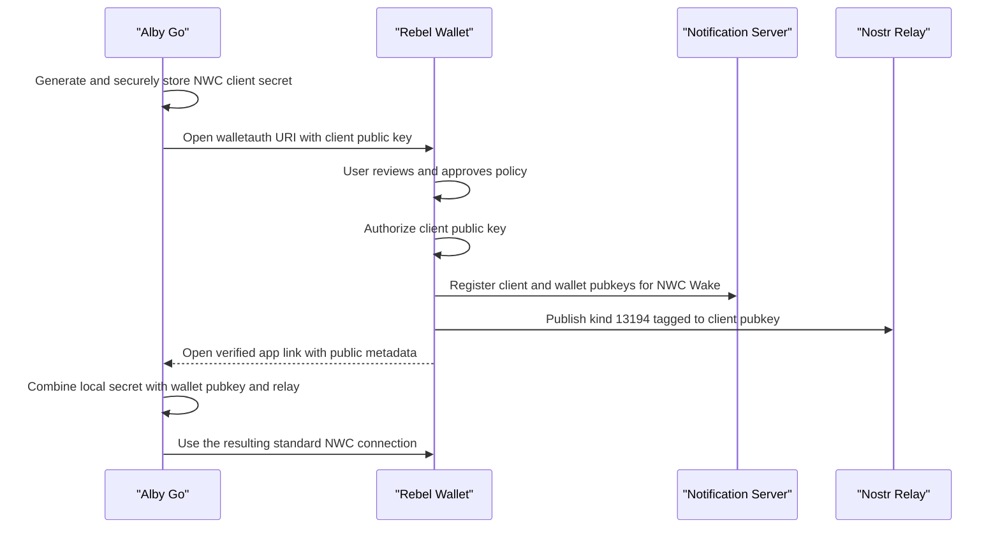

# NIP-47 Client-Created Secret Mobile Profile

**Status:** Draft implementation profile

## Abstract

This document is not a new wallet authorization protocol. It defines a mobile
integration profile for the NIP-47 client-created-secret Nostr flow proposed in
[nostr-protocol/nips#1818](https://github.com/nostr-protocol/nips/pull/1818).

The upstream proposal defines the interoperable authorization request and Nostr
completion event. This profile adds same-device return navigation using verified
iOS Universal Links or Android App Links and describes when a wallet registers
the resulting connection with an NWC Wake provider.

Implementations MUST NOT return a complete `nostr+walletconnect://` URI through
the mobile callback. The requesting app creates and retains the NWC client
secret. Only public connection metadata crosses the app boundary.

Because the upstream proposal is still under review, implementations SHOULD pin
the proposal revision they implement and SHOULD track later changes before
claiming compatibility with a merged NIP. This profile currently targets PR
revision `89fe83d5ebb7755a021c68b0aa643f79706f01aa`.

## Normative Foundation

The authorization wire format, parameter meanings, user approval requirement,
and Nostr completion event are defined by the client-created-secret proposal in
NIP-47 PR #1818. In particular:

- The requesting app generates the NWC client secret and corresponding public
  key.
- The authorization URI uses
  `nostr+walletauth://<client_pubkey>?relay=...` or a wallet-specific scheme such
  as `nostr+walletauth+rebelwallet://<client_pubkey>?relay=...`.
- The client secret MUST NOT appear in the authorization URI.
- After approval, the wallet publishes a NIP-47 `kind:13194` info event to the
  requested relay or relays.
- The info event includes a `p` tag containing the requesting app's client
  public key.
- The requesting app combines its retained client secret with the wallet
  service public key and relay to form the normal NWC connection URI.

This profile does not redefine those requirements.

## Architecture



The Nostr event remains the interoperable completion signal. The verified app
link is a same-device navigation optimization that lets a suspended mobile app
resume immediately without transferring secret material.

## Authorization Request

Example:

```text
nostr+walletauth+rebelwallet://687dd8ece211539364549b1f32c63eceec1e0661009ba65cf8ff2e73ba000746?relay=wss%3A%2F%2Frelay.getalby.com&relay=wss%3A%2F%2Frelay2.getalby.com&name=Alby%20Go&request_methods=pay_invoice%20get_balance%20make_invoice&max_amount=500000000&budget_renewal=monthly&return_to=https%3A%2F%2Falby-go.example%2Fnwa%2Fcallback&state=8d2a91f43bc941778a4b9985274c0a54
```

The URI authority is the 32-byte hexadecimal NWC client public key. Wallets
MUST reject a missing or malformed public key.

`relay` MUST appear at least once and MAY appear more than once. Other standard
request parameters, including `name`, `icon`, `expires_at`, `max_amount`,
`budget_renewal`, `request_methods`, `notification_types`, `isolated`, and
`metadata`, retain the meanings defined by PR #1818.

### Mobile Profile Parameters

This profile uses two optional parameters:

| Parameter | Requirement | Meaning |
| --- | --- | --- |
| `return_to` | OPTIONAL | Verified HTTPS Universal Link or Android App Link opened after approval, cancellation, or failure. |
| `state` | REQUIRED when `return_to` is present | Fresh correlation value containing at least 128 bits of entropy. |

The callback origin and path are requesting-app policy. Wallets MAY restrict
accepted callback origins, but platform association verification is the final
authority for app-only delivery.

## Wallet Approval

The wallet MUST show the user the requesting app name, requested methods,
budget, renewal interval, and relays before approval. The wallet MAY allow the
user to reduce permissions or budget.

The wallet MUST NOT authorize the client public key before explicit approval.
After approval it:

1. Stores the client public key and approved wallet-side policy.
2. Registers the connection with its NWC Wake provider, if enabled.
3. Publishes the targeted NIP-47 info event.
4. Opens `return_to`, if present, with public completion metadata.

Failure to open the mobile callback MUST NOT revoke an otherwise successful
authorization. The Nostr completion event remains valid and contains no client
secret.

## Nostr Completion

The wallet publishes a normal NIP-47 `kind:13194` info event signed by the
wallet service key. It MUST include:

```json
["p", "<client_pubkey>"]
```

The wallet MAY include its recommended relay as the next value in that `p` tag,
as defined by PR #1818. When present, the requesting app MUST use the recommended
relay.

The requesting app SHOULD subscribe before opening the wallet. It filters for
`kind:13194` and `#p` equal to its client public key, verifies the event, and
uses the event author as the wallet service public key.

## Verified Mobile Callback

The callback is an extension for same-device navigation. Result parameters MUST
be placed in the URL fragment so they are not sent to the HTTPS origin in a
normal request.

Approved callback:

```text
https://alby-go.example/nwa/callback#state=<state>&status=approved&wallet_pubkey=<wallet_service_pubkey>&relay=<relay>&relay=<relay>
```

Optional public fields:

- `lud16`: Lightning address reported by the wallet.
- `relay_url`: Compatibility alias for a single wallet-recommended relay.

Cancelled callback:

```text
https://alby-go.example/nwa/callback#state=<state>&status=cancelled
```

Error callback:

```text
https://alby-go.example/nwa/callback#state=<state>&status=error&error=<code>
```

The callback MUST NOT include `secret`, `nwc_uri`, `value`, or any other field
containing the client secret. The requesting app already owns that secret.

### iOS

The requesting app associates the exact callback domain and path using the
Associated Domains entitlement and an `apple-app-site-association` file.

The wallet opens the HTTPS callback using the universal-link-only option. It
MUST NOT fall back to a normal browser open or an unverified custom URI scheme.
If the link cannot open the associated app, the wallet reports that return
navigation failed while leaving the approved relay authorization intact.

For local iOS testing with an Associated Domains entry using
`?mode=developer`, the tester must enable **Settings > Developer > Associated
Domains Development** on the device before installing the development build.
This allows iOS to fetch the association file directly instead of relying on
Apple's CDN cache.

### Android

The requesting app associates the callback domain and path using a verified
Android App Link and `assetlinks.json`.

The wallet SHOULD require an app-only verified handler and MUST NOT put secret
material in the intent. Package allowlists MAY be used as additional policy but
do not replace Android domain verification.

### Web And Cross-Device

Web and cross-device clients use the upstream Nostr completion flow. They do not
need this mobile callback profile. The client retains its secret and listens for
the targeted info event on the requested relay set.

## Requesting App Processing

The requesting app MUST securely persist its generated client secret before
opening the wallet. On callback or Nostr completion it:

1. Loads the pending request and client secret.
2. Validates request age and `state` when processing a callback.
3. Validates the wallet service public key and relay URLs.
4. Constructs a normal NIP-47 URI locally:

   ```text
   nostr+walletconnect://<wallet_service_pubkey>?relay=<relay>&secret=<locally_retained_client_secret>
   ```

5. Calls `get_info` to verify the connection before committing it.
6. Treats callback and relay completion idempotently; the first valid completion
   wins.
7. Deletes pending secret material on cancellation, expiration, or permanent
   failure.

The client MUST NOT log the private key or constructed NWC URI.

## NWC Wake Integration

NWC authorization and NWC Wake are separate concerns. After approval, a mobile
wallet that supports NWC Wake registers at least:

- the approved client public key,
- the wallet service public key,
- each selected relay,
- the device push destination.

The notification server never receives the client secret. It watches public NWC
request envelopes matching the registered client and wallet public keys and
wakes the wallet according to the NWC Wake specification.

Deleting or revoking the connection SHOULD unregister the same tuple from the
notification server.

## Security Considerations

- The requesting app generates and retains the client secret.
- Authorization URLs, callbacks, logs, analytics, and notification servers MUST
  never contain that secret or a complete NWC URI.
- A custom URI scheme is acceptable for opening a wallet because the request
  contains only public data. It is not sufficient for verified callback
  delivery.
- Callback `state` prevents request confusion but does not prove callback-domain
  ownership; Universal Link or App Link verification provides that binding.
- Wallets MUST validate public keys, relay schemes, duplicate parameters,
  request size, and expiration before showing approval UI.
- Requesting apps SHOULD create a fresh client key for each connection to reduce
  correlation and simplify revocation.
- Wallets SHOULD use a distinct wallet service key per connection where their
  architecture permits it. A shared service key is compatible but exposes more
  metadata on public relays.

## Reference Implementations

- [NIP-47 client-created-secret proposal](https://github.com/nostr-protocol/nips/pull/1818)
- [Alby JavaScript SDK `NWAClient`](https://github.com/getAlby/js-sdk/blob/master/src/nwc/NWAClient.ts)
- Rebel Wallet: wallet approval, Nostr completion, and NWC Wake registration
- Zaprite P2P: client key generation and verified mobile completion
