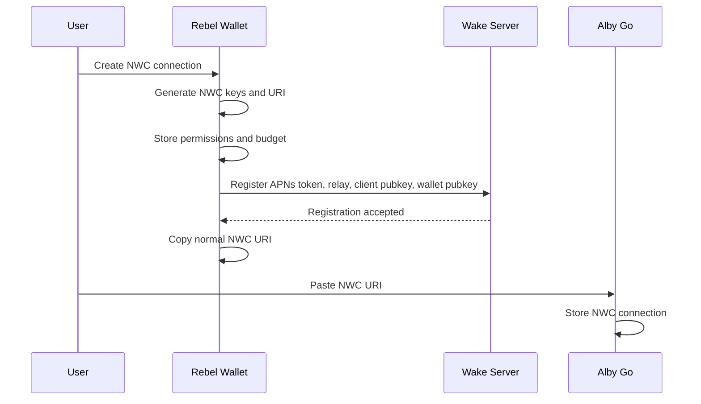
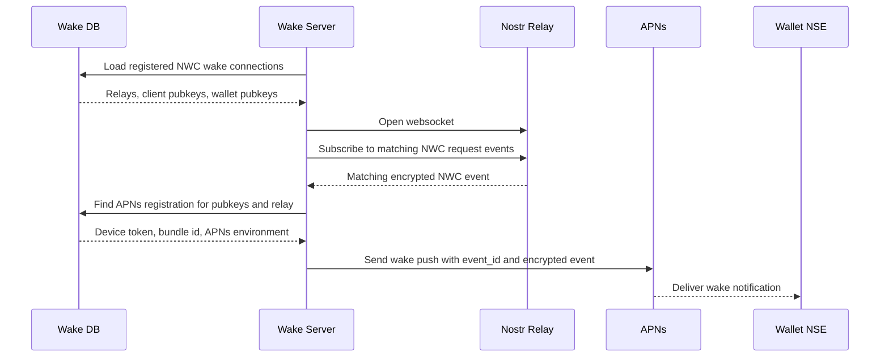
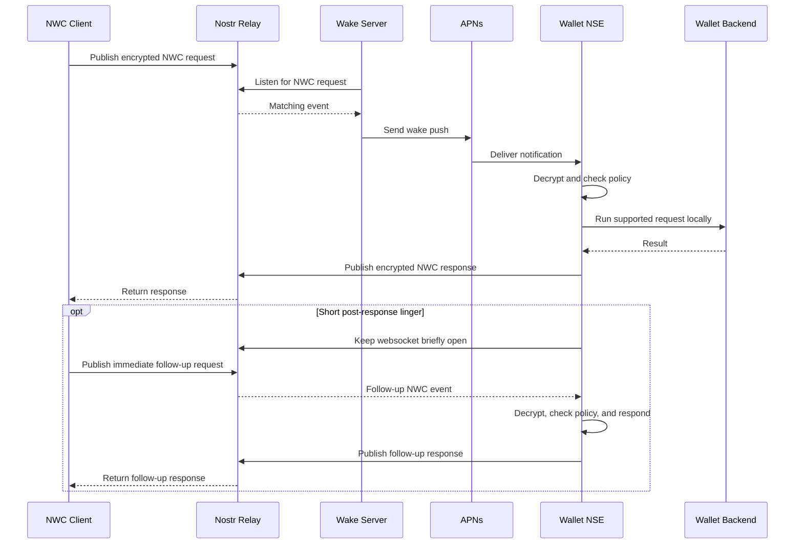

# NIP-47 Wake Extension

**Status:** draft optional

## Abstract

This NIP defines an optional wake mechanism for NIP-47 / Nostr Wallet Connect wallet services that are not continuously connected to relays. A concrete use case is a bill-pay or rent-collection app that has been authorized through NWC to pull a monthly payment from a user’s wallet. If the user’s wallet service runs inside a mobile wallet app, the app may be offline, backgrounded, or killed when the payment request is sent. This extension lets the wallet’s own wake provider learn that a valid NWC request is waiting by watching the same relays used by the NWC connection.

A wake-capable wallet privately registers wake metadata with a wallet-controlled wake provider when the NWC connection is created or updated. That metadata includes the platform push token, app identifier, relay URL, NWC client pubkey, and wallet service pubkey.

Example:

```text
nostr+walletconnect://<wallet_service_pubkey>
  ?relay=wss%3A%2F%2Frelay.getalby.com
  &secret=<client_secret>
  &lud16=tenant%40wallet.example
```

The wake provider discovers pending requests by watching configured relays for registered NWC connections. It may then use platform notification systems such as APNs, FCM, iOS Notification Service Extensions, Android background handlers, or other wallet-controlled mechanisms to wake the wallet app.

After being woken, the wallet app or extension obtains the original NIP-47 request from the relay or from an encrypted event included by the wake provider, decrypts it, applies wallet-side policy such as budgets and allowed methods, and responds using the normal NIP-47 response event.

This NIP does not change NIP-47 request or response formats. It does not define recurring payment rules, budgets, subscriptions, invoices, or authorization policy. Those remain NIP-47 wallet-service behavior. Wake is only a delivery mechanism for pending NWC requests, not payment authorization.

## Motivation

NIP-47 works well when the wallet service is online and listening on one or more relays. This fits servers, custodial wallets, home nodes, desktop apps, and always-on wallet bridges.

Mobile wallets are different. A mobile wallet app may not be connected to the relay when a NWC request arrives. On iOS, the app may be suspended or killed. On Android, the app may be backgrounded or restricted by battery policy. As a result, a valid NWC request can sit on a relay or be dropped before the wallet sees it.

This extension solves one narrow problem:

- A valid NWC request has been published.
- The wallet app may be asleep.
- The wallet provider needs a standard way to wake the wallet.

The relay does not need to understand wake. The relay does not need to call HTTP endpoints. The relay can be any ordinary Nostr relay that carries NIP-47 events.

## Design Summary

Normal NWC flow:

```text
NWC client
→ publishes kind:23194 request to relay
→ wallet service is online
→ wallet service decrypts request
→ wallet service applies policy
→ wallet service pays or rejects
→ wallet service publishes kind:23195 response
```

NWC Wake flow:

```text
NWC client
→ publishes normal kind:23194 request to relay
→ wake provider observes the request on the relay
→ wallet wake provider sends push/wake notification
→ wallet app wakes
→ wallet app obtains original kind:23194 request from relay or encrypted wake payload
→ wallet app decrypts request
→ wallet app applies NWC wallet-side policy
→ wallet app pays or rejects
→ wallet app publishes normal kind:23195 response
```

The key difference from relay-extension wake designs is:

- The relay does not need to wake the wallet.
- The wake provider can connect to ordinary relays as a Nostr client.
- NWC clients do not need to know about the wake provider.

## Architecture

### Creating And Registering An NWC Connection



APNs is not called during NWC registration. The wallet app already has its APNs device token and sends that token to the wake provider with NWC metadata.

### Wake Server Relay Watch



The wake server matches the public Nostr envelope. It does not decrypt the NWC request.

### Handling A Relay-Observed NWC Request



## Goals

This NIP aims to:

- Preserve standard NIP-47 request and response events.
- Work with off-the-shelf Nostr relays.
- Avoid requiring relay extensions, plugins, or webhooks.
- Avoid exposing raw APNs, FCM, or platform push tokens.
- Allow mobile wallets to support best-effort NWC payments.
- Keep payment authorization inside the wallet.
- Allow wallets to use iOS NSE, APNs, FCM, Android handlers, or any other wallet-controlled wake mechanism.

## Non-goals

This NIP does not define:

- A new payment protocol.
- A replacement for NIP-47.
- A recurring payment protocol.
- A budget or subscription policy format.
- Raw APNs/FCM token exchange.
- A generic Nostr push-notification system.
- A requirement that relays call HTTP endpoints.
- A guarantee that mobile wallets are always online.

This is not the model:

```text
user gives relay:
  push_token
  app_id = com.wallet.example
```

Raw platform push tokens are wallet-provider-internal data and MUST NOT be published to relays or embedded directly in Nostr events.

## Terms

### Client

A NIP-47 client that sends wallet requests.

Examples:

- bill-pay app
- rent-collection app
- point-of-sale app
- merchant backend
- subscription service
- automation service

### Wallet service

The NIP-47 wallet service pubkey addressed by a request event.

### Wake provider

A service controlled by the wallet provider. It watches relays for registered NWC request events and decides whether to wake a wallet app.

### Wallet app

A mobile, desktop, or native wallet application that can process a pending NIP-47 request after being woken.

### Wake registration

A wallet-provider-internal registration that maps an NWC connection to a platform wake target such as an APNs device token.

## NWC URI

Example:

```text
nostr+walletconnect://<wallet_service_pubkey>
  ?relay=wss%3A%2F%2Frelay.getalby.com
  &secret=<client_secret>
  &lud16=tenant%40wallet.example
```

Single-line example:

```text
nostr+walletconnect://abcdef...?relay=wss%3A%2F%2Frelay.getalby.com&secret=1234...&lud16=tenant%40wallet.example
```

Wake does not add a public query parameter to the NWC URI. Clients publish normal NIP-47 events to the configured relay. The wallet provider's wake service discovers matching events through its private registration state and relay subscriptions.

Wallets MUST NOT put raw APNs, FCM, or other platform push tokens in the NWC URI.

## Wallet Provider Registration

In relay-watcher mode, the wallet app registers wake metadata with its own wake provider when the NWC connection is created or updated.

This registration is provider-internal and MUST NOT be published to relays or exposed in the NWC URI.

Example registration fields:

| Field | Description |
| --- | --- |
| APNs/FCM token | Platform wake token for the wallet app install. |
| bundle/app id | Platform app identifier used by the push provider. |
| `client_pubkey` | Pubkey that signs NWC request events for this connection. |
| `wallet_service_pubkey` | Pubkey tagged by NWC request events. |
| `relay` | Relay to watch for this connection. |
| `enabled` | Whether wake is enabled for this connection. |

The wake provider and mobile wallet app are usually tightly coupled and often operated by the same developer or organization. This is because the wake provider needs platform-specific app metadata, such as APNs topics, push environments, device tokens, and app-group or extension assumptions, while the mobile app needs to trust that the wake provider only wakes registered wallet connections. A third-party wake provider is possible, but it would need an explicit trust, registration, and operational relationship with the wallet app developer.

### Provider-Private Push Registration Endpoint

A wallet provider MAY expose a private registration endpoint used only by its own wallet app. This endpoint is not part of the public NWC Wake client protocol. It is a provider implementation detail for binding an app install's platform push token to one or more NWC wake registrations.

For example, a wallet app might call:

```http
POST https://push.wallet.example/register-nwc-push
```

Example request:

```json
{
  "id": "<wallet-app-install-id>",
  "push_service": "apns",
  "push_token": "<apns-device-token>",
  "app_id": "com.wallet.example",
  "environment": "sandbox",
  "client_pubkey": "<nwc-client-pubkey>",
  "wallet_service_pubkey": "<wallet-service-pubkey>",
  "relay": "wss://relay.getalby.com/v1",
  "name": "Monthly bills",
  "enabled": true
}
```

For Android, the same endpoint can use `"push_service": "fcm"` and place the FCM registration token in `push_token`.

The exact path, authentication scheme, storage model, and payload shape are provider-specific. Implementations SHOULD authenticate this endpoint, SHOULD only accept registrations from wallet app builds they control, and MUST NOT expose the platform push token in the NWC URI, Nostr events, relay subscriptions, or public responses.

### Reference Implementation Registration Shape

The prototype notification server uses a provider-private endpoint with Nostr HTTP auth:

```http
POST https://push.wallet.example/register-nwc-push
Content-Type: application/json
Authorization: Nostr <base64-kind-27235-event>
```

The auth event is signed by `wallet_service_pubkey` and binds the request URL, HTTP method, and SHA-256 hash of the JSON body. This proves that the wallet app controls the NWC wallet-service key being registered without exposing the NWC secret or platform push token publicly.

Register or update a push target:

```json
{
  "id": "<wallet-app-install-id>",
  "push_service": "apns",
  "push_token": "<apns-device-token>",
  "app_id": "com.wallet.example",
  "environment": "sandbox",
  "client_pubkey": "<nwc-client-pubkey>",
  "wallet_service_pubkey": "<wallet-service-pubkey>",
  "relay": "wss://relay.getalby.com/v1",
  "name": "Monthly bills",
  "enabled": true
}
```

Disable the registration for the same NWC connection by sending the same identifying fields with `"enabled": false`:

```json
{
  "id": "<wallet-app-install-id>",
  "push_service": "apns",
  "push_token": "<apns-device-token>",
  "app_id": "com.wallet.example",
  "environment": "sandbox",
  "client_pubkey": "<nwc-client-pubkey>",
  "wallet_service_pubkey": "<wallet-service-pubkey>",
  "relay": "wss://relay.getalby.com/v1",
  "name": "Monthly bills",
  "enabled": false
}
```

The [Mutiny notification-server](https://github.com/mutinyWallet/notification-server/) is a useful reference implementation lineage for a Rust push notification server. It is not an NWC Wake specification dependency, but it demonstrates the kind of provider-operated service that stores notification registrations and sends platform push notifications from server-side credentials.

## Client Behavior

The client does not call the wake provider. The wake provider has already been registered by the wallet app and is watching the relay for matching NWC request events.

The client flow is:

1. Build normal NIP-47 request.
2. Publish `kind:23194` event to the relay from the NWC URI.
3. Wait for normal `kind:23195` response.
4. If no response arrives, retry or fall back to manual payment.

Payment succeeds only when the client receives a valid NIP-47 response indicating success. Wake is invisible to the client and remains best-effort.

## Request Expiration

Clients SHOULD include an `expiration` tag on NIP-47 requests that may trigger wake.

Example NIP-47 request event:

```json
{
  "kind": 23194,
  "tags": [
    ["p", "<wallet_service_pubkey>"],
    ["encryption", "nip44_v2"],
    ["expiration", "1730000300"]
  ],
  "content": "<encrypted NIP-47 request>"
}
```

Recommended expiration windows:

| Request type | Window |
| --- | --- |
| interactive payment | 30–120 seconds |
| scheduled/background payment | 2–10 minutes |
| retry attempt | use a fresh request |

Wake providers MAY skip waking for NIP-47 events with no expiration or excessively long expiration windows.

## Wake Provider Validation

When a wake provider observes a relay event, it MUST validate the public Nostr envelope against its registered NWC connections before sending a platform wake notification:

- `relay` is allowed for this wallet connection.
- `event_id` is present.
- `wallet_service_pubkey` maps to a wallet app installation.
- The user has enabled wake for this NWC connection.
- The referenced event exists on the relay or in a trusted event cache.
- The referenced event id matches `event_id`.
- The referenced event signature is valid.
- The referenced event kind is `23194`.
- The referenced event has a `p` tag matching `wallet_service_pubkey`.
- The referenced event pubkey matches `client_pubkey`.
- The referenced event is not expired.
- The event has not already triggered excessive wake attempts.

The wake provider MUST NOT treat an observed event as payment authorization.

The wake provider MUST NOT require access to decrypted NIP-47 content.

## Platform Wake Notification Payload

After observing a matching NWC request event, the wake provider may send APNs, FCM, local push, platform-specific wake, or another wallet-controlled notification to the wallet app.

The platform wake payload SHOULD contain only enough information for the wallet app to obtain the original NIP-47 request.

Logical payload:

```json
{
  "protocol": "nwc_wake",
  "version": "v1",
  "relay": "wss://relay.getalby.com",
  "event_id": "0123456789abcdef...",
  "wallet_service_pubkey": "abcdef0123456789...",
  "nwc_event": "<optional encrypted nostr event JSON>"
}
```

The `nwc_event` field is optional. It contains the original encrypted Nostr event JSON and allows a mobile extension to respond without refetching an ephemeral event from the relay.

The platform wake payload MUST NOT include:

- NWC secret
- decrypted NWC request
- BOLT11 invoice
- amount
- memo
- payer name
- payee name
- payment hash
- preimage
- wallet balance
- wallet API token

The encrypted Nostr event may contain ciphertext for payment details, but the wake provider and push provider cannot decrypt it unless they also control the wallet-service key.

Visible notification text SHOULD be generic.

Good:

```text
Payment request pending
```

Bad:

```text
Rent payment of $100 to Landlord Nick is due
```

Wallets MAY show richer payment details only after the wallet app locally fetches and decrypts the original request.

## Wallet App Behavior After Wake

After receiving a wake notification, the wallet app SHOULD:

1. Parse the wake payload.
2. Use an embedded encrypted Nostr event if present, otherwise open a short-lived connection to the relay.
3. Fetch the event by `event_id` when needed.
4. Verify the event id.
5. Verify the event signature.
6. Verify `kind:23194`.
7. Verify the `p` tag matches `wallet_service_pubkey`.
8. Verify the event is not expired.
9. Decrypt the NIP-47 request using normal NWC encryption.
10. Verify the requesting client pubkey is authorized for this NWC connection.
11. Apply wallet-side NWC policy.
12. Execute or reject the request.
13. Publish a normal `kind:23195` response.
14. Optionally keep the relay connection open for a short post-response linger window.
15. Close the relay connection when done.

Wallet-side policy may include:

- allowed methods
- spending budgets
- interval limits
- fee limits
- user approval requirements
- connection expiry
- merchant restrictions

The wallet MUST NOT interpret wake as user consent.

Mobile wallets MAY handle a limited set of methods inside a platform extension while the main app is killed. For example, the Rebel Wallet prototype handles `get_info`, `get_balance`, `make_invoice`, and `pay_invoice` in an iOS Notification Service Extension, subject to local permissions and budget policy.

### Short-Lived Post-Response Linger

After a wallet app or platform extension successfully responds to a wake-triggered NWC request, it MAY keep the relay websocket open for a short, bounded linger window and subscribe for immediate follow-up NWC requests addressed to the same wallet service pubkey.

This exists for client compatibility and latency. Some NWC clients treat the first response as proof that the wallet service is online and then immediately send follow-up requests, such as `get_info` followed by `get_balance`, `make_invoice`, or `pay_invoice`. Without a linger window, each follow-up request may require another wake notification, or the client may report a timeout while the wake provider observes and wakes the wallet again.

The linger window is best-effort and MUST NOT be treated as a durable online wallet service. Mobile platform extensions have strict runtime limits. For example, an iOS Notification Service Extension has only a short amount of execution time before the system may call its expiration handler. Implementations SHOULD therefore:

- keep the linger window to a few seconds
- reserve enough time to publish the original response before lingering
- cap the number of follow-up requests handled during one wake
- only process requests from already-authorized NWC client pubkeys
- apply the same permission, budget, expiry, replay, and fee policy as the original request
- close the relay connection before the platform extension expires

If a follow-up request arrives after the linger window closes, the normal wake path still applies: the wake provider may observe the request on the relay and send another platform wake notification.

## Event Fetch Fallback

Because NIP-47 request events may be ephemeral, the wallet app may fail to fetch the request from the relay after waking.

To improve reliability, the wake provider MAY maintain a temporary encrypted event cache.

The wake provider MAY expose a wallet-authenticated fetch endpoint such as:

```http
GET https://push.wallet.example/nwc-events/<event_id>
```

The cache SHOULD store only the original encrypted Nostr event.

The cache MUST NOT store decrypted NWC content unless the wake provider is also the wallet service and is authorized to do so.

Recommended cache retention:

- until request expiration
- or a short maximum TTL such as 10 minutes

Wallet app fetch order:

1. Try relay by `event_id`.
2. If missing, try wallet provider's encrypted event cache.
3. If still missing, abort and do not pay.

## NIP-47 Response Behavior

The wallet responds using the normal NIP-47 response event.

Example success:

```json
{
  "kind": 23195,
  "tags": [
    ["p", "<client_pubkey>"],
    ["e", "<request_event_id>"],
    ["encryption", "nip44_v2"]
  ],
  "content": "<encrypted response>"
}
```

Encrypted content:

```json
{
  "result_type": "pay_invoice",
  "error": null,
  "result": {
    "preimage": "0123456789abcdef...",
    "fees_paid": 123
  }
}
```

Example policy failure:

```json
{
  "result_type": "pay_invoice",
  "error": {
    "code": "QUOTA_EXCEEDED",
    "message": "Monthly spending quota exceeded"
  },
  "result": null
}
```

## Optional Wallet Info Advertisement

Wallets MAY advertise wake support in their NIP-47 wallet info event.

Example `kind:13194` event:

```json
{
  "kind": 13194,
  "pubkey": "<wallet_service_pubkey>",
  "content": "pay_invoice get_balance get_info notifications",
  "tags": [
    ["encryption", "nip44_v2"],
    ["notifications", "payment_received payment_sent"],
    ["nwc_wake", "v1"],
    ["nwc_wake_relay", "wss://relay.getalby.com"]
  ],
  "created_at": 1730000000
}
```

This advertisement is optional.

## Relay Watcher Mode

A wallet provider MAY run a relay watcher. This is the primary mode used by the current Rebel Wallet prototype.

In watcher mode, the wake provider connects to normal Nostr relays as a client and subscribes for NIP-47 requests addressed to wallet-service pubkeys it controls.

Example subscription:

```json
["REQ", "nwc-wake-watch", {
  "kinds": [23194],
  "authors": ["<client_pubkey>"],
  "#p": ["<wallet_service_pubkey>"]
}]
```

When the wake provider observes a matching request, it may include the encrypted event in the platform wake payload and wake the wallet app.

Watcher mode does not require relay support beyond ordinary Nostr subscriptions.

The watcher flow is:

```text
NWC client publishes request
wake provider observes request on relay
wake provider sends platform wake notification
wallet app or extension responds normally over NWC
```

## Security Considerations

### Wake is not authorization

Wake only means:

```text
A NIP-47 request is waiting.
```

The wallet still decides:

- Is this client authorized?
- Is this method allowed?
- Is this invoice allowed?
- Is the budget available?
- Is the interval valid?
- Should this require user confirmation?

### No raw push tokens

Raw APNs, FCM, or platform tokens MUST NOT be placed in:

- NWC URI
- Nostr event tags
- client metadata
- relay metadata

Push tokens belong inside the wallet provider’s private infrastructure.

### Metadata leakage

The wake provider may learn:

- wallet service pubkey
- client pubkey
- relay URL
- event id
- request timestamp

The wake provider SHOULD NOT learn:

- amount
- invoice
- memo
- payee
- payer
- payment hash
- preimage
- wallet balance

unless it is also the wallet service and is authorized to decrypt the request.

### Local extension key material

Mobile platforms may require local key material in an app extension if the wallet wants to respond while the main app is killed. For example, an iOS Notification Service Extension may need enough local state to decrypt the NWC request, apply wallet policy, and sign the NWC response.

Wallets SHOULD minimize this material, keep it local to the app and extension, and prefer platform-protected storage such as shared Keychain access where possible.

### Replay protection

Clients SHOULD include expiration tags.

Wake providers MUST deduplicate by `event_id`.

Wallets MUST reject expired requests.

### Spam protection

Wake providers MUST rate-limit by:

- `wallet_service_pubkey`
- `client_pubkey`
- relay URL
- `event_id`
- IP address or network origin

Wallets SHOULD allow users to disable wake per NWC connection.

### User controls

Wallets SHOULD expose controls such as:

- Allow wake for this connection
- Allowed methods
- Budget
- Interval
- Max fee
- Require notification
- Require tap-to-confirm above amount
- Expiration date
- Revoke connection

These controls are wallet-side NWC policy, not part of this wake extension.

## Privacy Considerations

Wallet providers SHOULD use generic push notification text.

Wake providers SHOULD avoid logging full Nostr event envelopes longer than necessary.

Wake providers SHOULD avoid storing encrypted NWC events beyond expiration.

Wake providers MUST NOT place payment details in platform push payloads.

## Compatibility

This NIP is backwards-compatible with NIP-47.

Clients that do not support wake continue sending normal NIP-47 requests.

Wallets that do not support wake continue requiring an online wallet service.

Relays do not need to support this NIP.

## Example: Zaprite P2P Rent Autopay

### Setup

- Tenant opens Zaprite P2P.
- Tenant creates NWC connection for Zaprite Rent.
- Zaprite P2P sets wallet-side policy:
  - method: `pay_invoice`
  - budget: `$100/month equivalent`
  - interval: monthly
  - max fee: wallet-defined
- Zaprite P2P returns NWC URI:
  - `relay=wss://relay.getalby.com`
  - `secret=<client_secret>`
- Zaprite P2P registers the device token and NWC public metadata with its wake provider.
- Zaprite Rent stores the NWC URI.

### Monthly payment

- Zaprite Rent creates Lightning invoice to landlord.
- Zaprite Rent publishes NIP-47 `kind:23194` `pay_invoice` request to `relay.getalby.com`.
- Zaprite wake provider observes the request on the relay.
- Zaprite wake provider sends APNs/FCM push to Zaprite P2P with the encrypted event.
- Zaprite P2P NSE wakes.
- Zaprite P2P verifies and decrypts the request.
- Zaprite P2P checks monthly budget.
- Zaprite P2P pays invoice using configured wallet backend.
- Zaprite P2P publishes `kind:23195` response to `relay.getalby.com`.
- Zaprite Rent receives response and marks rent paid.

### Failure path

- wallet does not wake
- push is disabled
- device is offline
- relay dropped event
- event cache missing
- budget exceeded
- payment fails
- request expires

Then the client may retry with a fresh NIP-47 request or fall back to manual payment.

## Example NWC URI

```text
nostr+walletconnect://abcdef0123456789abcdef0123456789abcdef0123456789abcdef0123456789?relay=wss%3A%2F%2Frelay.getalby.com&secret=0123456789abcdef0123456789abcdef0123456789abcdef0123456789abcdef&lud16=tenant%40zaprite.com
```

Decoded:

| Field | Value |
| --- | --- |
| `wallet_service_pubkey` | `abcdef0123456789abcdef0123456789abcdef0123456789abcdef0123456789` |
| `relay` | `wss://relay.getalby.com` |
| `secret` | `0123456789abcdef0123456789abcdef0123456789abcdef0123456789abcdef` |
| `lud16` | `tenant@zaprite.com` |

## Open Questions

- Should temporary encrypted event cache behavior be standardized?
- Should the wallet app be allowed to fetch the encrypted event from the wake provider if the relay dropped it?
- Should clients be required to include an expiration tag when using wake?
- Should APNs/FCM payloads standardize an embedded encrypted event field such as `nwc_event`?
- Should provider-private relay watcher registration be standardized or remain implementation-specific?

## Suggested Community Summary

NWC already supports app-specific wallet connections, wallet-side constraints, and budgets. The remaining problem for mobile wallets is delivery: the wallet service may not be connected when a request arrives. This proposal adds a wallet-controlled wake mechanism. A wallet provider can register mobile wake metadata, watch ordinary Nostr relays for matching NWC requests, and wake the mobile wallet using APNs, FCM, iOS NSE, Android background handlers, or another wallet-controlled mechanism. The wallet processes the original NIP-47 request normally. Wake is not authorization, no raw push tokens are exposed, and off-the-shelf Nostr relays remain compatible.

## Source

<https://chatgpt.com/c/6a45dc5b-25e0-83ea-831a-e886070e22ce>
